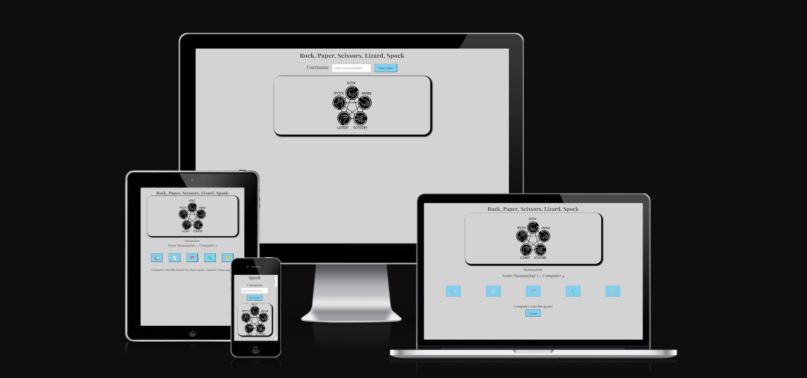
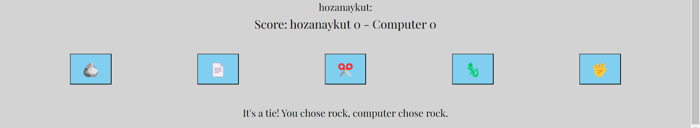
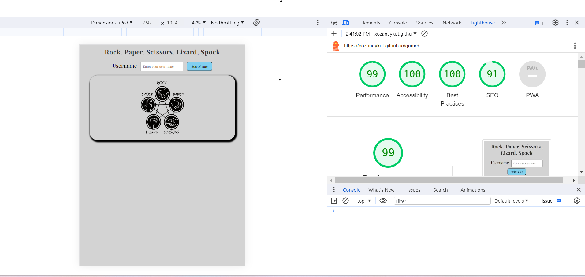
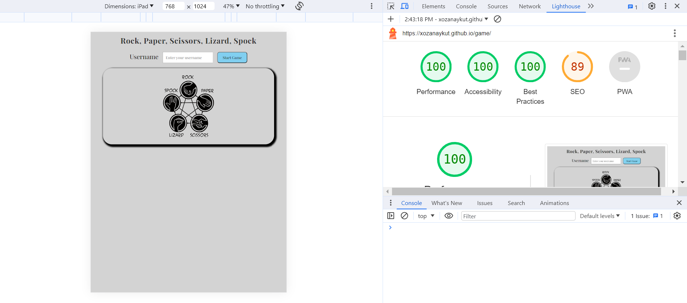

# [Rock, Paper, Scissors, Lizard, Spock](https://xozanaykut.github.io/game/)

Rock Paper Scissors, Lizard, Spock is a simple and fun app for people of all ages. Users can practice while learning the game and improve their thinking skills at the same time. Users of this game will learn the rules of Rock Paper Scissors, Lizard, and Spock so they can apply them in their lives when making decisions with others. This site is aimed at adults and children as a simple app for learning, practicing, and having fun.
____

____
## Existing Features
 
### Header
- The title at the top of the page shows the name of the game:  Rock, Paper, Scissors, Lizard, Spock, in a fun font that contrasts with the background.

This title clearly tells the user which game they are playing.
___

___
## Username

- Prior to commencing the game, the system collects the user's name.

- Upon game initiation, the user's name is showcased within the game interface.
___

___

## Game Option
- The game options include a clear instruction followed by a series of options that can be selected to play Rock, Paper, Scissors, Lizard, Spock. These options are interactive buttons that the user can click to make their selection.

- This section provides interactive buttons that the user can click to make their choice and play the game.
___

___

### The Game Results

- When a user clicks on an option, the game board displays their chosen element.

- The JavaScript code randomly selects an option for the computer player, displays the computer's choice on the screen, and then determines the winner.

- The result of the winner is announced to the user under the options, and the scores are updated for both players.

- This way, it becomes clear for users who won and what the scores are, making it easy to understand the game's outcome and scores.
___

___

## Restart

- The game result is displayed.
- The Restart button offers the option to restart the game
___

___

### The Game Rules
- In addition to the traditional Rock, Paper, Scissors rules, the game includes the following rules:

- Rock crushes Scissors.
- Rock crushes Lizard.
- Paper covers Rock.
- Paper disproves Spock.
- Scissors cuts Paper.
- Scissors decapitates Lizard.
- Lizard poisons Spock.
- Lizard eats Paper.
- Spock vaporizes Rock.
- Spock smashes Scissors.
- By integrating these rules, players can enjoy the game with more strategy and excitement.
___

___

## Features Left to Implement

-Background music can be added

____
## Performance

___

___

## Validator Testing

- HTML: No errors were found when passing through the official [W3C validator](https://validator.w3.org/nu/?doc=https%3A%2F%2Fxozanaykut.github.io%2Fgame%2F)
- CSS: No errors found when passing through the official [(Jigsaw) validator
Deployment](https://jigsaw.w3.org/css-validator/validator?uri=https%3A%2F%2Fxozanaykut.github.io%2Fgame%2F&profile=css3svg&usermedium=all&warning=1&vextwarning=&lang=en)
____

## Deployment

The site was deployed to GitHub pages. The steps to deploy are as follows:

1. In the GitHub repository, navigate to the Settings tab.
2. Under Code and automation on the left side select Pages.
3. Under Source select Deploy from a branch.
4. Under Branch select Main and after Save.
5. Refresh the page.

The live link can be found here - <https://xozanaykut.github.io/game/>
____

## Credits

### Content

- Start the Game code has benefited from
[Btkakademi](https://www.btkakademi.gov.tr)

___
